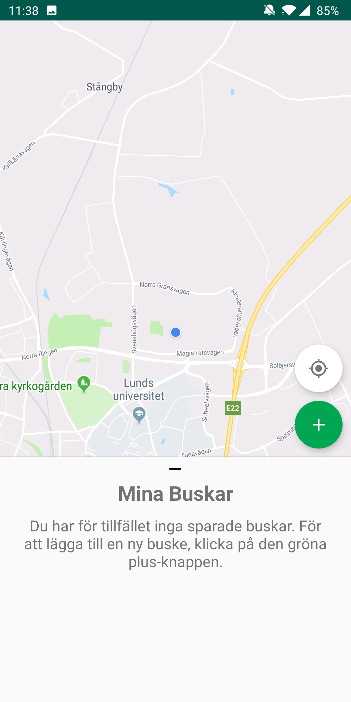

# Buska - an Android app for forgetful students
The purpose for Buska was to create an application where students can save
the location of their hidden alcohol outside. It is provided as an Android
application, which uses different technologies such as GPS, vibration motor
and accelerometer. This application was created for the Advanced Interaction
Design
([MAMN01](http://www.eat.lth.se/kurser/interaktionsdesign/avancerad_interaktionsdesign_mamn01/))
at LTH by [@enniomara](https://github.com/enniomara),
[@chrillebile](https://github.com/chrillebile) and
[@IAmAlthere](https://github.com/IAmAlthere).

## Screenshots

    
    
    
    
    
    

